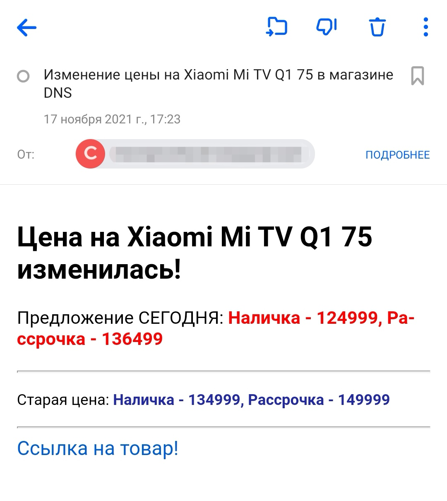

### История про то, как сильно хотелось купить новый телевизор :)

Скрипт для отслеживания цены на телевизор Xiaomi Mi TV Q1 75 в магазине DNS.



* `npm install` - Для установки зависимостей.
* Перед запуском переименовать файл .env.example в .env и заполнить необходимыми данными.
* Коллекция в MongoDB - "checkPrice"
* `npm run start` - Для запуска сервиса.

Для запуска скрипта в systemd подготовлен конфиг - ```dns-price-scrapper.service```,
необходимо заполнить ```WorkingDirectory``` и ```ExecStart```. 

По умолчанию цена проверяется каждые 2 часа, если она изменилась - придет уведомление на почту.